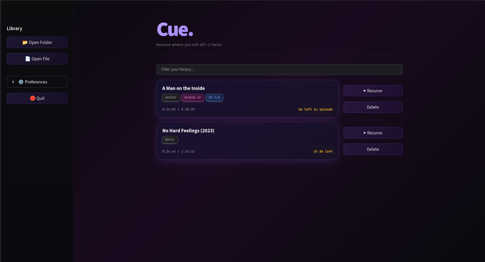

# Cue ⏯️

**Cue** is a modern, cross-platform media launcher that remembers exactly where you left off. It acts as a smart dashboard for your local media, tracking playback progress for both individual files and folder-based playlists.



## ✨ Features

* **Universal Resume:** Remembers playback position for any video or audio file.
* **Cross-Platform:** Works natively on **Windows** (mpv) and **Linux** (Celluloid or mpv).
* **Folder Support:** Intelligently resumes entire folders (series/playlists) from the exact file you stopped at.
* **Visual History:** See progress bars, duration, and "Finished" status for your media library.
* **Driver System:** Configurable backend to support both CLI players (STDOUT) and GUI wrappers (IPC Sockets).

## 🛠️ Prerequisites

1.  **Python 3.7+**
2.  **Media Player:**
    * *Windows:* [mpv](https://mpv.io/)
    * *Linux:* [Celluloid](https://github.com/celluloid-player/celluloid) OR [mpv](https://mpv.io/)
3.  **Tkinter:** (Usually included with Python, but on Linux you might need `sudo apt install python3-tk`)

## 📦 Installation

1.  Clone or download this repository.
2.  Install the required Python library:
    ```bash
    pip install streamlit
    ```
3.  Run the application:
    ```bash
    streamlit run app.py
    ```

## ⚙️ Configuration

**Cue** attempts to auto-detect your operating system on first run.

### Windows 🪟
* **Default Player:** `mpv`
* **Driver Mode:** `mpv_native`
* *Note:* Ensure `mpv` is added to your System PATH, or paste the full path to `mpv.exe` in the Cue Settings menu.

### Linux 🐧
* **Default Player:** `celluloid`
* **Driver Mode:** `celluloid_ipc`
* *Note:* If using Flatpak, set the "Player Path" in settings to:
    `flatpak run io.github.celluloid_player.Celluloid`

### Changing Drivers
You can switch drivers in the **Settings** sidebar menu:

- mpv
- ipc
- vlc

## 🚀 Usage

1.  Click **Open File** or **Open Folder**.
2.  Select your media.
3.  Watch!
4.  Close the player when you are done.
5.  **Cue** will automatically save your spot. Click **Resume** next time to pick up right there.